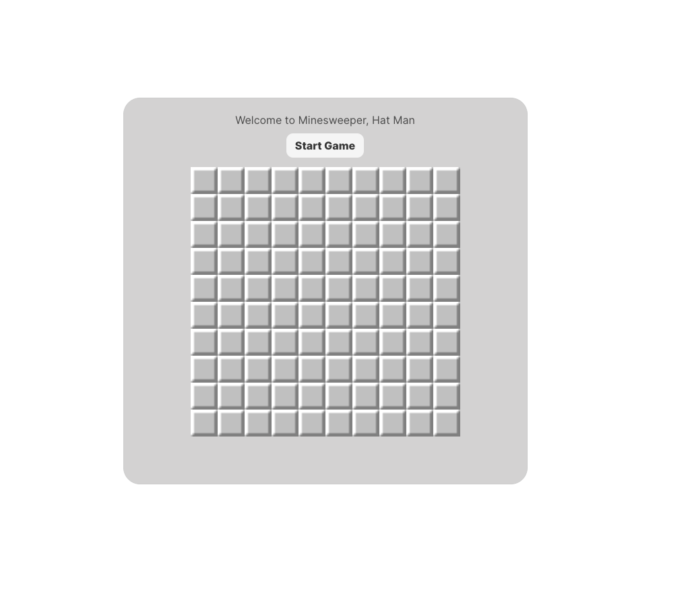

# Dead Inside Games 

## Description
Dead Insidge games is a repository of retro games. The primary game is Minesweeper. Future development will continue to expand into hangman, tik-tak-toe, tetris, and more. 

Walkthrough video: 

## Table of Contents
- [Installation](#installation)
- [Usage](#usage)
- [Credits](#credits)
- [License](#license)
- [Features](#features)
- [How to Contribute](#how-to-contribute)
- [Tests](#tests)
- [Questions](#questions)

## Installation
You will need node and MySQL installed on your machine to run the application locally. 
Download the repo. Be sure to run "npm i" to install the node modules necessary. Intiallize the database by running "mysql -u root -p", entering your password, and then sourcing the schema.sql in the db folder. If you would like, run "npm build" to seed your database with data. Once complete, run "npm run dev" (uses nodemon) or "node server" to initilaze the server on your local host.

You can also access the live application here: https://dead-inside-games.herokuapp.com/minesweeper

## Usage
Once you've started the server, navigate in a browser to http://localhost:3001/. You should be prompted to log in. If you have not signed up, do that first. You'll be required to enter a unique user name and password and accept the terms and conditions. Once complete, you can use this username and password to log in. 

Upon log in, you'll be be redirected to the homepage that includes minesweeper. To begin playing, click the start button. A timer will begin a countdown from 120 seconds. To clear the board, you'll need to click on every tile that is not a mine. Once only the mines are left, you've won the game and you'll be given the opportunity to record your highscore, which is the amount of time you have remaining on the timer. Your username and the time left will be posted to the highscores page if you click "Save Highscore". If you hit a mine, you will lose the game. A button will appear allowing you to "Play Again". 

## Credits
Contributors include: 
- https://github.com/ColdWeatherBoyy
- https://github.com/ColinSprows
- https://github.com/BobbyCharms
- https://github.com/Dev-Devin
- https://github.com/dmantilla17 
- Special thank you to Max Oshawa for assisting the team in the game logic and the "reveal tiles" functionality. 

## License
N/A

## Features
Being able to play the retro game, Minesweeper!

## How to Contribute
Please reach out directly to any of the contributors or submit a pull request to th existing repo.        

## Tests
N/A

## Questions
Please contact one of the contributors listed above if there are questions. 
